# MINI-PROJECT

## Bash Scripts and its execution.

### FIRST SCRIPT

A simple script to welcome DevOps enthusiasts to class.
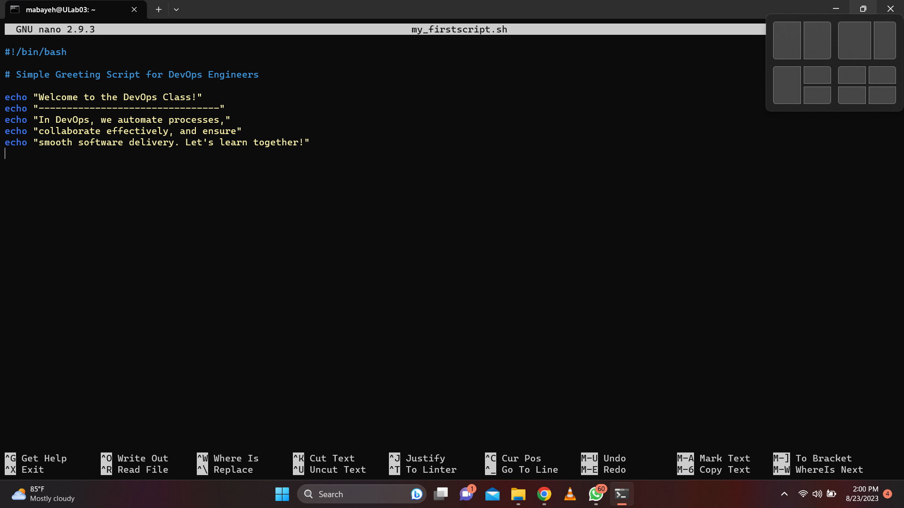
The Execution
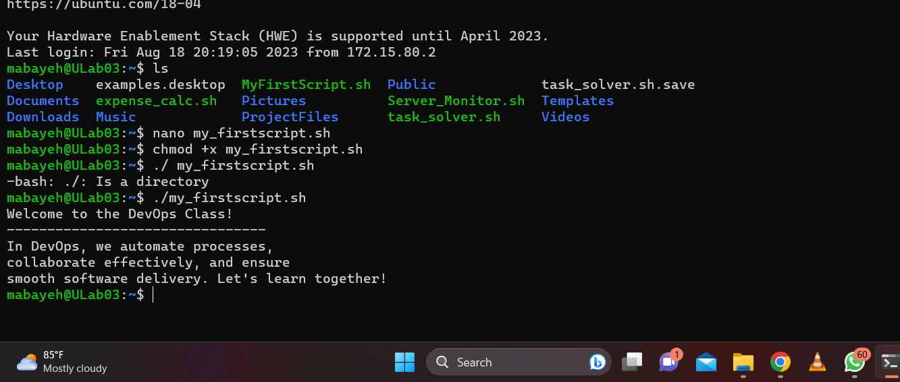

### SERVER MONITORING AND REPORTING SCRIPT

- Uptime: How long the server had been running
- free-m: Memory space utilized
- df-h: Disk partition utilized.

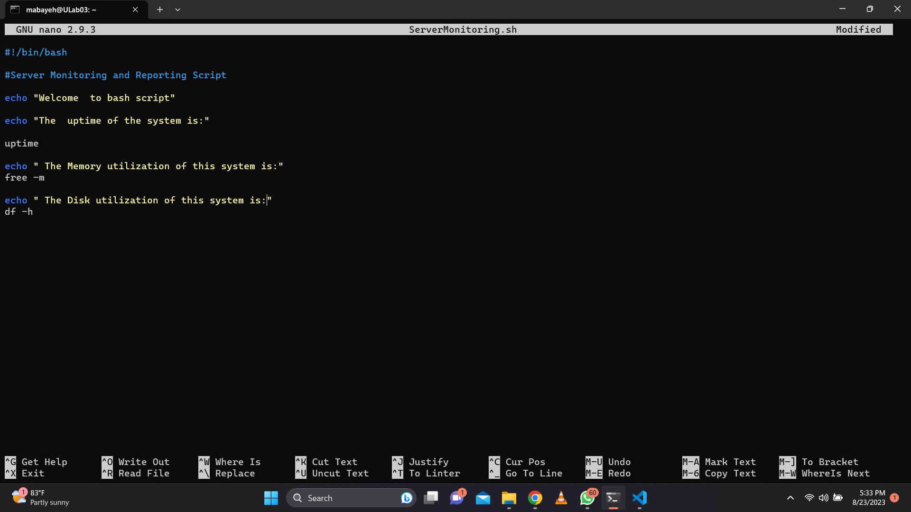
Execution
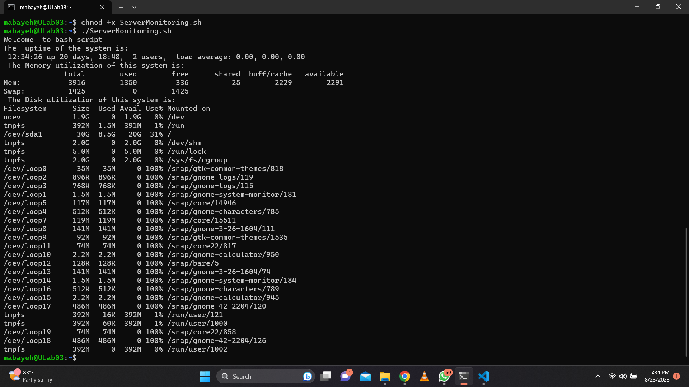

### DEFINING A VARIABLE

A short script on how to define a variable.
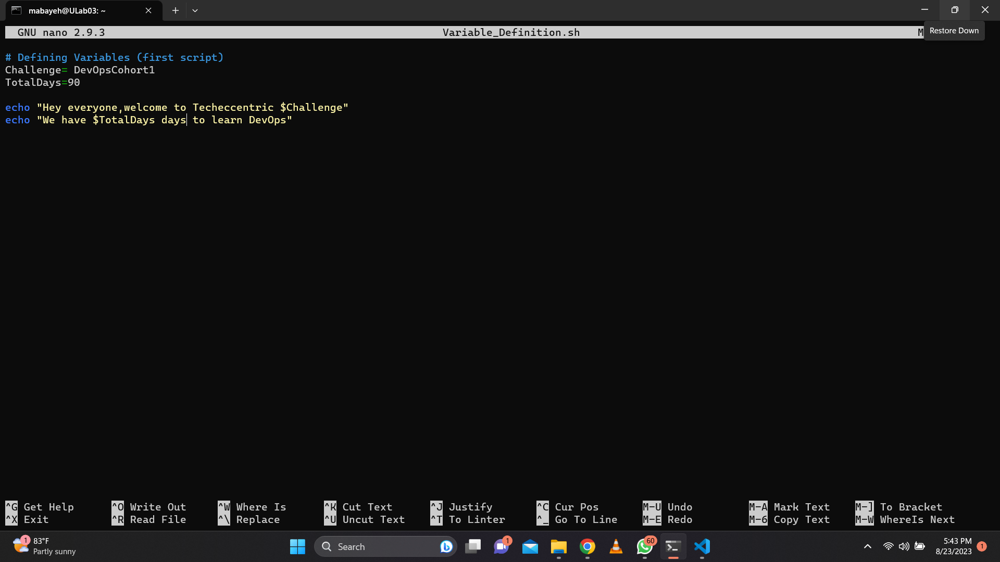
Execution
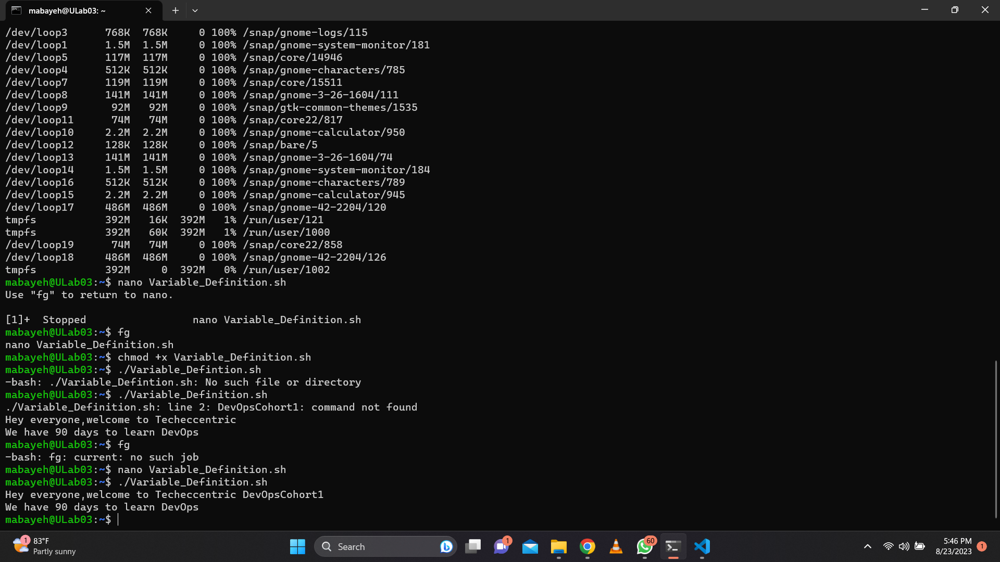

### DECLARING A VARIABLE

This script shows how variables are declared in bash.
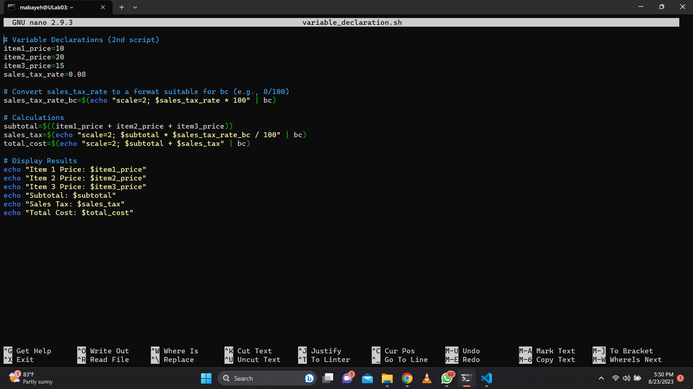
Execution
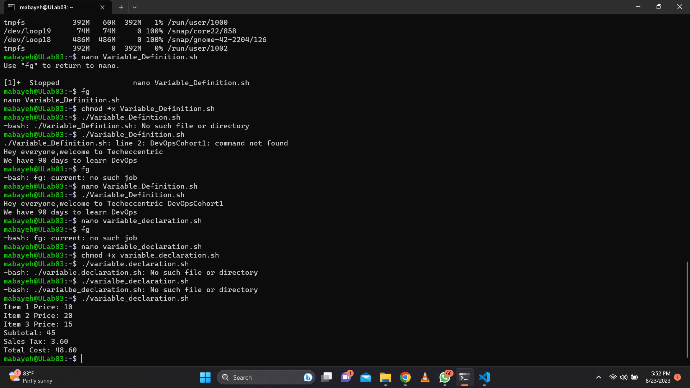

### DATA TYPES

This shows a list of the data types in bash scripting.
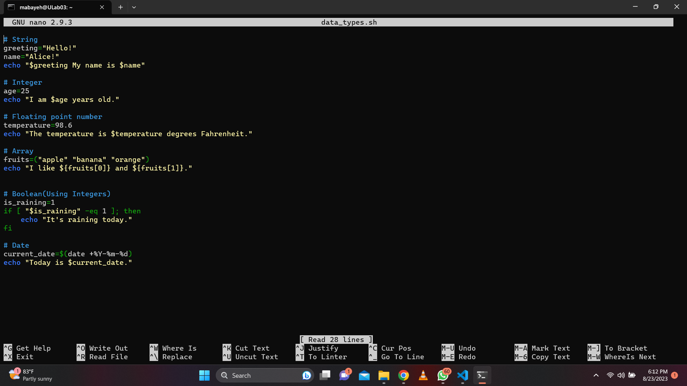
Execution
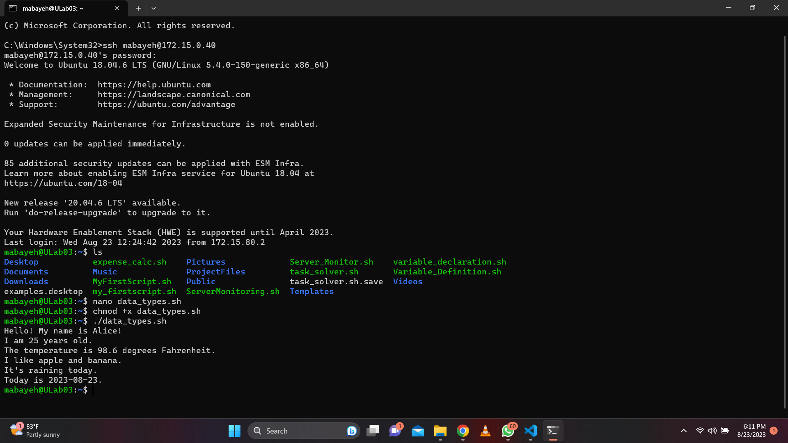

### WEATHER REPORT

A script to display the weather report of my state.
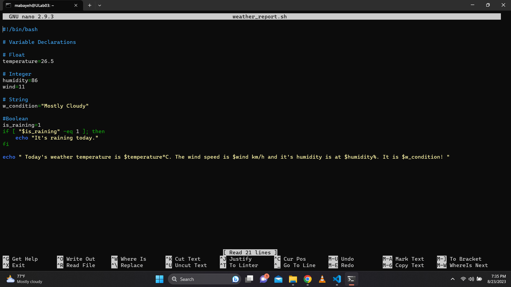
Execution
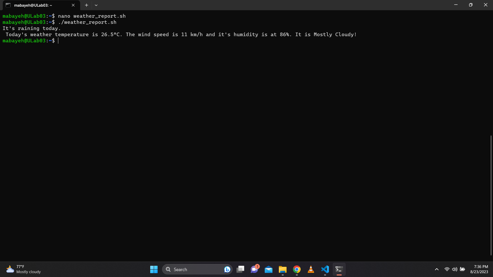
